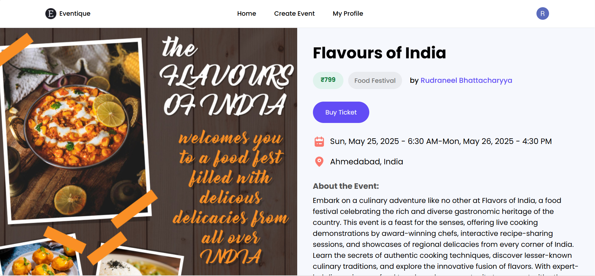

# Eventique

### Introduction

Eventique is a full-featured event management platform that allows users to create, browse, and manage events effortlessly. With secure authentication, advanced search & filtering, and integrated payment processing, Eventique provides a seamless experience for both event organizers and attendees.

### Features

- **Authentication and Event Management (CRUD)**: Secure user management with easy signup/login to create, view, update, and delete events dynamically.
- **Search & Filter**: Quickly find events based on categories, location, and preferences.
<!--
- **Admin Panel**:
  - Schedule, reschedule, or delete any appointment.
  - Adjust appointment timings based on availability.
  - Manage user bookings efficiently.
    -->
- **Dynamic Categories**: Easily add new categories for better event organization.
- **Secure Payments**: Smooth checkout and payment processing with Stripe.
- **Order Management**: View and track event orders efficiently.

---

## Tech Stack

### Frontend

- **Next.js**: Framework for server-side rendering and optimized routing.
- **TypeScript**: Ensures type safety and enhances development experience.
- **Tailwind CSS**: Utility-first CSS framework for rapid UI development.

### Backend

- **Node.js**: Efficient server-side JavaScript runtime.
- **Clerk**: Authentication and user management service for secure access control.

### Payments & Orders

- **Stripe**: Secure and seamless payment gateway integration.
- **Event Orders**: Tracks and manages event-related transactions.

### Features & Enhancements

- **Search & Filter**: Advanced search and filtering for event discovery.
- **Event Categorization**: Dynamic categories for better event organization.
- **Related Events**: Displays relevant events to improve user engagement.

    

---

## Screenshots

_**Eventique Homepage**_

_**All Events**_

_**Create Event Page**_

_**Event Page**_

---

## Future Enhancements

This project is continuously evolving, with several planned improvements to enhance user experience and functionality:

- **Social Media Integration**: Allow users to share events directly on social platforms, increasing engagement and visibility.
- **Multi-Language Support**: Expand accessibility by providing multilingual options for a global audience.
- **Advanced Analytics Dashboard**: Offer event organizers insights into attendance, ticket sales, and engagement metrics.

---

## Contributing

We welcome contributions to make Eventique even better! Please follow these steps:

1. Fork the repository.
2. Create a new branch for your feature or bug fix.
3. Commit your changes and push the branch.
4. Open a pull request for review.

---

## Acknowledgments

This project is inspired by the innovative work of Adrian at [JavaScript Mastery
](https://www.youtube.com/@javascriptmastery).Thank you for your guidance.
